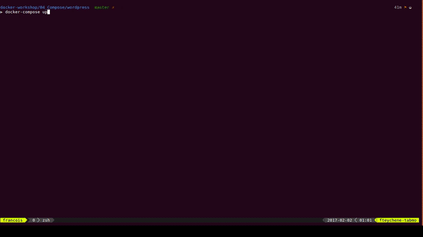
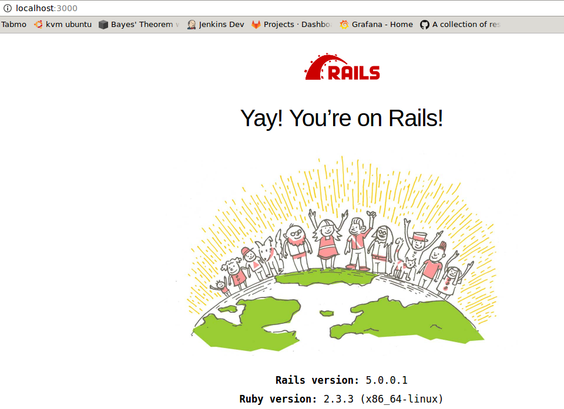

# Basics

## Overview
This section is dedicated to the tool `docker-compose` to manager multiple containers at the same time.

## Steps

### Introduction to docker-compose

Compose is a tool for defining and running multi-container Docker applications. With Compose, you use a Compose file to configure your application’s services. Then, using a single command, you create and start all the services from your configuration. To learn more about all the features of Compose see the list of features.

Compose is great for development, testing, and staging environments, as well as CI workflows. You can learn more about each case in Common Use Cases.

Using Compose is basically a three-step process.

1. Define your app's environment with a Dockerfile so it can be reproduced anywhere.
2. Define the services that make up your app in docker-compose.yml so they can be run together in an isolated environment.
3. Lastly, run docker-compose up and Compose will start and run your entire app.

### Start a wordpress with compose

A wordpress stack is composed by a wordpress server and a mysql database linked to it.  
Theses two containers are linked together and `docker-compose` allow us to start it and define this stack easily.

We define the following [docker-compose.yml](./wordpress/docker-compose.yml) to start a wordpress and its database.
```
docker-compose up
```
You shall see the execution of the two containers database and worpress and you can access to the installation by accessing `localhost:8000`.  


After stopping the stack you can delete all the information by running `docker-compose down`

### Ruby on rail with build when starting

You can also define a `docker-compose.yml` file to define a service as a local folder to build when you start the stack.  
One example can be a ruby on rails stack with a database and the application built on the fly.

We define the following [docker-compose.yml](./rails/docker-compose.yml) to build a ruby on rails app and its database.
```
docker-compose up --build
```
This command will launch the stack and will build all the services defining a `build` configuration.  
After launching the stack you can access to `localhost:3000` to see your ruby on rails app running.  


After stopping the stack you can delete all the information by running `docker-compose down`

## Excercice

Reverse engineer the `wordpress` docker image to define a `docker-compose.yml` for the wordpress stack to integrate custom code from your repository when launching the stack.

## References :
 * [docker-compose.yml reference](https://docs.docker.com/compose/compose-file/)


___

Previous | Next
:---: | :---:
← [Link](../03_Link) |   →
